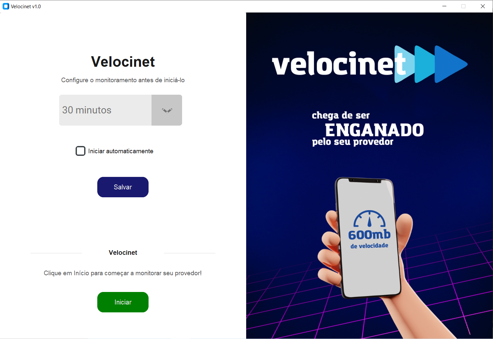

 

  

  <h3 align="center">Velocinet</h3>

  

    O projeto é destinado ao monitoramento da velocidade da internet em sequência de tempo de forma automática
     
     
  

<!-- TABLE OF CONTENTS -->

  
Conteúdo

  <ol>
    <li>
      <a href="#sobre">Sobre o Projeto</a>
      <ul>
        <li><a href="#built">Instalando a aplicação</a></li>
      </ul>
    </li>
    <li>
      <a href="#comeco">Começando</a>
      <ul>
        <li><a href="#entendendo">Entendendo as configurações</a></li>
        <li><a href="#dados">Onde ficam salvos os testes?</a></li>
      </ul>
    </li>
    <li><a href="#uso">Usando</a></li>
    <li><a href="#licenca">Licença</a></li>
    <li><a href="#contato">Contato</a></li>
  </ol>

<!-- ABOUT THE PROJECT -->
## Sobre o Projeto

Este projeto tem como objetivo fornecer uma solução profissional para o monitoramento contínuo e automatizado da velocidade da internet, visando oferecer praticidade e eficiência aos usuários. O software pode ser configurado para iniciar automaticamente junto com o sistema operacional, proporcionando uma experiência de utilização mais conveniente. É importante destacar que este sistema foi projetado com não invasividade em mente, sendo facilmente desativado na inicialização automática por meio de um único clique no painel de configurações.

(<a href="#readme-top">Topo</a>)

### Instalando a aplicação

Aqui não tem segredo! Vou te ajudar a chegar até o projeto estar rodando em sua máquina!

Antes de começarmos, é importante que você tenha feito o download da última versão do software, garantindo assim sua compatibilidade e correções juntamente com os utilitários que serão adicionados a medida que o software avança.

1. Abra o seu terminal e digite:

`git clone https://github.com/ldnovaes/monitoramento-velocidade-internet.git`

2. Abra o arquivo main.exe
 
3. Configure-o de acordo com suas necessidades.
 
4. Se você está vendo uma janela como esta, tudo está funcionando muito bem. 

(<a href="#readme-top">Topo</a>)

## Começando

Aqui daremos início ao projeto. Durante a instalção, você abriu o arquivo `main.exe`. Continuaremos a partir dessa abertura, então caso tenha-o fechado, abra-o novamente para continuar com o tutorial.

#### Entendendo as configurações

Olhemos para as configurações a seguir: 

1. O tempo é destinado a entender o prazo entre cada monitoramento. Se você deixar o padrão (30 minutos) ele irá rodar um teste a cada 30 minutos, e então preencher uma nova linha no arquivo excel. É possível escolher até outros 3 tempos. Como: 60, 90 e 120 (minutos)
2. A inicialização automática é destinada a decidir se o software será ou não inicializado junto com o Windows. Por padrão ele é desativado, mas é recomendado que você ative-o. Futuramente, se você não tiver mais interesse em monitorar sua internet, basta voltar nesse arquivo `main.exe` e ele te dará a opção de remover o monitoramento da inicialização automática. Podemos ver isso na imagem a seguir:
3. 

#### Onde ficam salvos os testes?

Por padrão os testes são salvo em sua pasta de documentos em uma planilha do excel chamada `dados.xlsx`. A qualquer momento, você pode consultá-la e verificá-la. Nela contém diversas informações úteis. Entre elas, está uma imagem hospedada online, onde é possível ver um print do teste que foi realizado naquela hora. Um exemplo é:

Já, por outro lado, um outro print que deixarei é de como essa planilha é configurada:

(<a href="#readme-top">Topo</a>)

## Usando

Após entender as configurações, é necessário que você reinicie o computador para que o teste possa funcionar de forma autompática, caso você tenha escolhido essa opção. Se caso optou por um monitoramento manual, tente inicializar o arquivo `main.exe` e clicar em iniciar. Entretanto, se certifique de que cada inicialização você repita esse processo, para obter o maior conjunto de dados de testes de velocidade possíveis.

Já na página de cadastro de venda, de acordo com o que é digitado no campo `Produto` e `Cliente` o sistema é capaz de pesquisar através desses nomes para endereçar o Cliente e o Produto à Venda de forma automática.

(<a href="#readme-top">Topo</a>)

## Licença

Distribuído sob a licença MIT. Veja `LICENSE.txt` para mais informações.

(<a href="#readme-top">Topo</a>)

## Contato

Hotmail - [Envie-me um email](leandroduarte2012@hotmail.com)
Linkedin - [Envie-me uma DM](https://linkedin.com/in/ldnovaes)

(<a href="#readme-top">Topo</a>)

